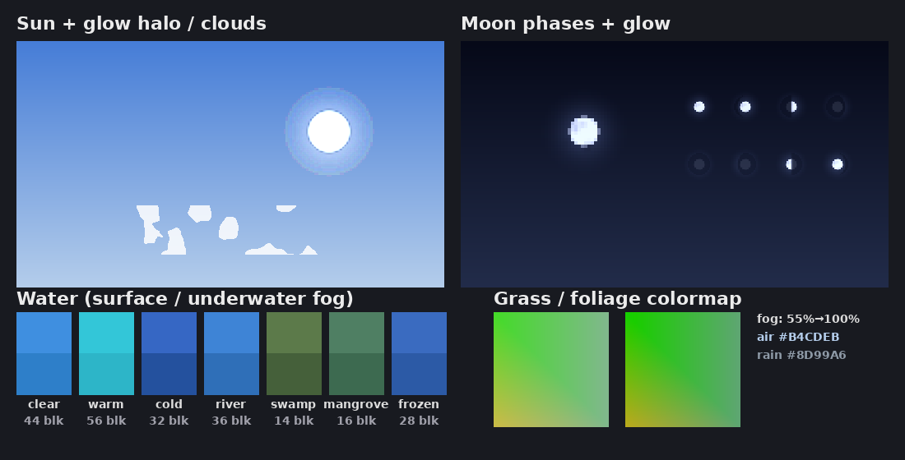

# Idex Lite Shader – แสงเงาเบา ๆ สำหรับมือถือสเปคต่ำ

Resource pack สำหรับ Minecraft Bedrock ทำมาให้มือถืออย่าง **Helio G99 (GPU Mali-G57 MC2)** โดยเฉพาะ
**ไม่แตะ shader ของเกม** จึงเล่นบนตัวเรนเดอร์ปกติได้ **FPS เท่าเดิมกับ vanilla** (ไม่ต้องใช้แอปเสริม/แพตช์เกม)



## ได้อะไรบ้าง
| ส่วน | ผล |
|---|---|
| หมอกระยะไกล (`fogs/`) | หมอกบาง ๆ เริ่มที่ 55% ของระยะมองเห็น ไล่จางเข้ากับท้องฟ้า ดูมีมิติ และ **ซ่อนขอบชังก์** ตอนเปิด render distance ต่ำ |
| หมอกฝน | ตอนฝนตกจะมีหมอกเทาหม่น ๆ บรรยากาศมืดครึ้ม |
| น้ำ (`biomes_client.json`) | น้ำใสขึ้น สีสวยตามไบโอม (ทะเลอุ่นสีฟ้าอมเขียว, ทะเลเย็นน้ำเงินเข้ม, หนองน้ำเขียวขุ่น) มองใต้น้ำได้ไกล 28–56 บล็อก |
| พระอาทิตย์/พระจันทร์ | มีแสงฟุ้งรอบดวง (เหมือน bloom) พระจันทร์มีหลุมและเงาตามข้างขึ้นข้างแรม |
| เมฆ | เมฆน้อยลง ท้องฟ้าดูโล่ง (ใช้ได้ทั้งเมฆ 2D/3D) |
| สีหญ้า/ใบไม้ (`colormap/`) | สีอุ่นและสดขึ้นเล็กน้อย |

### ที่ทำไม่ได้ (บอกตรง ๆ)
- **เงาของบล็อก/ตัวละครแบบเรียลไทม์, แสงสะท้อนผิวน้ำ, god rays** ต้องแก้ shader ของเกม ซึ่ง resource pack ธรรมดาทำไม่ได้
  ต้องใช้ Vibrant Visuals (ของเกมเอง) หรือแอปแพตช์เกม ซึ่งหนักเกินสำหรับ G99 และ Vibrant Visuals มักไม่เปิดให้ GPU Mali-G57
- เงามุมบล็อก (ambient occlusion) ใช้ของเกมเองได้ ฟรี: เปิด **Smooth Lighting**

## ตั้งค่าเกมที่แนะนำสำหรับ Helio G99
| ตั้งค่า | ค่า |
|---|---|
| Render Distance | 8–10 ชังก์ (หมอกของแพ็คจะช่วยกลบขอบ) |
| Smooth Lighting | เปิด (นี่คือ "เงา" ที่ได้ฟรี) |
| Beautiful Skies | เปิด |
| Fancy Graphics | เปิดได้ ถ้ากระตุกให้ปิด |
| Fancy Leaves / Fancy Bubbles | ปิด |
| Render Clouds | เปิด (ถ้ากระตุกให้ปิด) |
| Ray Tracing / Vibrant Visuals | ปิด |
| Field of View | 70–80 |

## ติดตั้ง
1. ดาวน์โหลด `dist/Idex_Lite_Shader.mcpack` แล้วกดเปิด (Minecraft จะ import ให้เอง)
2. ตั้งค่า → Global Resources → เปิด **Idex Lite Shader** (ใช้ได้ทุกโลก)
3. ถ้าใช้กับแพ็คอื่น ให้ Idex Lite Shader อยู่ **บนสุด** เพื่อให้หมอก/น้ำของแพ็คนี้มีผล

## ปรับแต่งเอง
แก้ค่าที่ต้นไฟล์ `tools/build_lite_shader.py` แล้วสร้างใหม่:
```
python3 tools/build_lite_shader.py
```
- `AIR["fog_start"]` – ยิ่งน้อยหมอกยิ่งหนา (0.55 = ค่าเริ่มต้น, 0.85 = ใสเกือบเหมือน vanilla)
- `AIR["fog_color"]` – สีหมอก/ขอบฟ้า
- `WATER` – สีน้ำ ความใส และระยะมองใต้น้ำของแต่ละแบบ
- `BIOMES` – ไบโอมไหนใช้น้ำแบบไหน

รองรับ Minecraft Bedrock 1.21.40 ขึ้นไป
